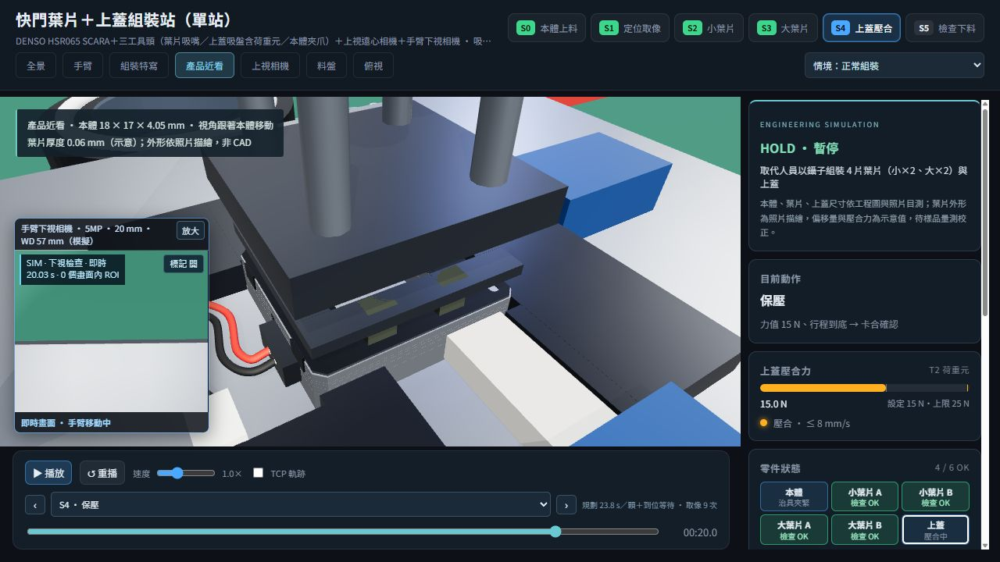

# 快門組裝動畫：干涉與物理可行性檢查

檢查日期：2026-09-26。檢查對象為目前網頁幾何與正常／疊片 NG 動作序列，長度單位為 mm。

## 發現與修正

| 問題 | 修正後行為 |
|---|---|
| SCARA 肘部與連桿在起始及取蓋路徑穿過透明後罩 | 後罩由 z = −640 移至 −780，外罩占地由 1440 × 980 改為 1440 × 1120。取樣姿態中最小後罩間隙 78.29。 |
| 原有直伸導線與端子超出本體料格，葉片外形偏離料格中心 | 導線改為本體左側的預成形 U 彎，端子一同收納；本體料格改為 33 × 23，中心 x 偏移 −3.5；大小葉片料格改為 13.2 × 16，中心偏移 −4.2。取料座標不變。 |
| 治具左側導線出口太窄 | 避讓區擴大至 z = −8 ～ 9.5；移除不合適的窄槽底板。 |
| 上蓋卡勾直接穿入本體側壁 | 本體增加卡勾避讓與扣合槽，卡勾接近時向外張開最多 0.20，落入扣合槽後復位。此為待實物確認的示意設計。 |
| 壓合 0.30 過行程造成吸附墊穿入上蓋 | 均壓板、吸附墊與背架一起浮動，過行程由四根彈簧吸收；顯示力值依彈簧壓縮量變化。 |
| 本體夾取及治具鬆夾時突然跳位 | 夾爪閉合期間逐步校正示意偏移，治具鬆開後保留已定位的位置，直到下一次夾取。 |
| 相機雖可渲染影像，但實體台板與燈具封住上視光路 | 台板及 ESD 墊增加同軸開孔，環形光、鏡筒改為中空；機櫃改為有內部空間的殼體。 |
| NG 葉片從吸嘴直接跳到盒底 | 增加約 0.109 秒落下動畫，以重力加速度 9,810 mm/s² 計算垂直落下時間；落下後位於盒底。 |

## 驗證結果

- `tools/verify-physics.mjs`：正常流程 1,315、NG 流程 1,471 個姿態，最大取樣間隔 20 ms，包含各步驟端點；無檢出的碰撞。檢查工具與固定障礙、工具與手臂、工具與實際透明料盤壁／底、手臂與外罩；移動推塊也納入障礙。
- 靜態產品容納檢查：本體含導線／端子、成品、上蓋及葉片在料格中，加入 ±0.35 平移與 ±0.03 rad 旋轉組合；檢查葉片與本體，以及 201 個上蓋接近／卡勾張開位置。
- 壓合時吸附墊未穿入上蓋，最大彈簧壓縮 0.30；鬆夾不移動已定位本體；NG 葉片單調下落並停在盒底；上視中心光線通過台板、ESD 墊與環形光。
- `tools/verify.mjs`：正常／NG 完整流程、連續播放、576 個料格取料／移動高度、定位結果與取像視野通過。正常規劃節拍 23.76 秒，NG 規劃節拍 26.61 秒；實際播放含到位等待。
- `tools/verify-product-detail.mjs`：9 個上蓋貫穿孔、324 個上蓋吸附面取樣、葉片吸附面、線圈與葉片 0.135 間隙及 1,287 條上視輪廓光線檢查通過。
- 瀏覽器確認起始姿態、壓合產品近景與相機畫面正常載入，沒有模擬故障。

數據檔：[physics.json](physics.json)、[verification.json](verification.json)、[product-detail.json](product-detail.json)。

## 適用範圍與實機待確認

碰撞檢查使用網格包圍盒／方向包圍盒、幾何頂點及光線取樣，並非完整實體布林或連續碰撞證明。未建立所有軟管、電纜、製造公差、氣路延遲或故障運動。

導線 U 彎假設上料前已預成形，尚未驗證真實線長、最小彎曲半徑與剛度。新增卡勾避讓槽與 0.20 張開行程需要供應商 CAD／樣品確認；動畫不能證明實際產品可加工、可彈性扣合或不會疲勞破壞。壓合力 15 N、彈簧行程 0.30 是展示參數，需以荷重元實測、壓頭與產品允許載荷決定。NG 落料忽略薄片空氣阻力與旋轉，僅表達從吸嘴落至盒底的連續過程。
