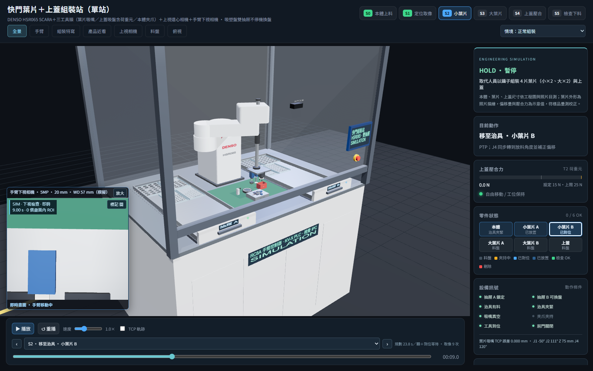
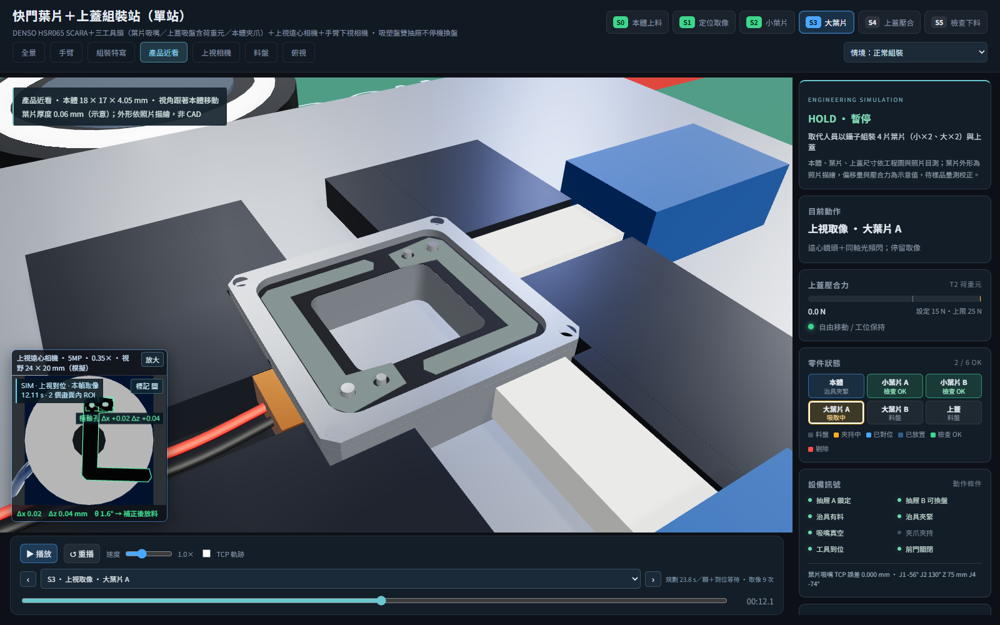
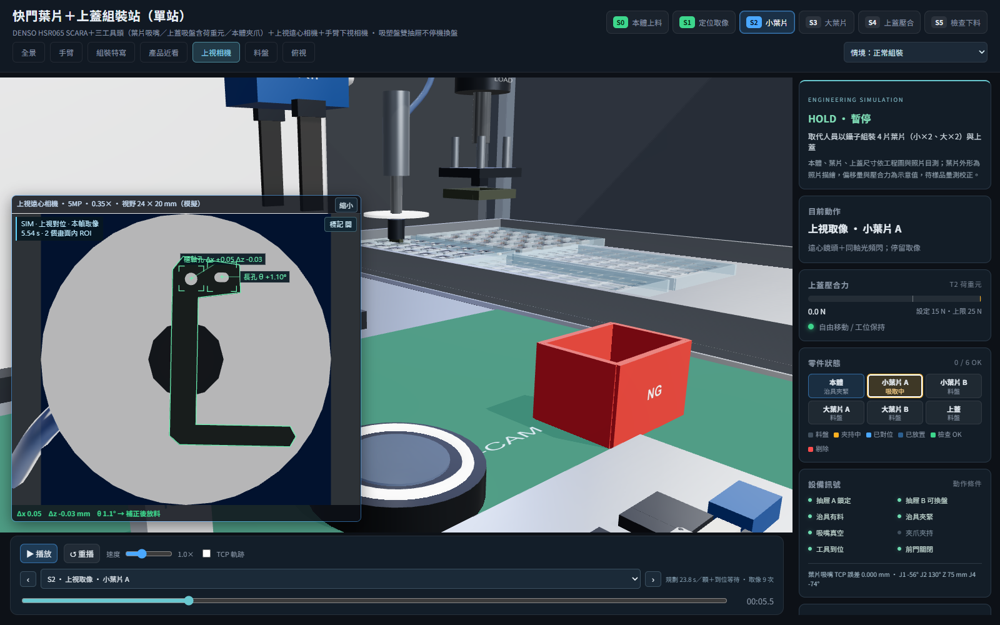
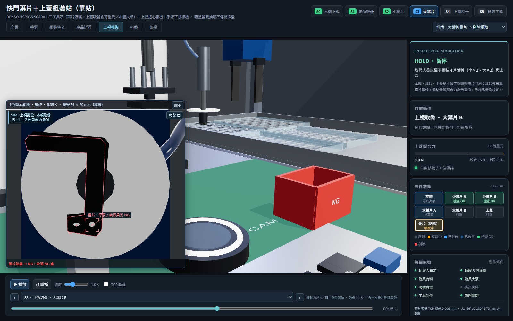
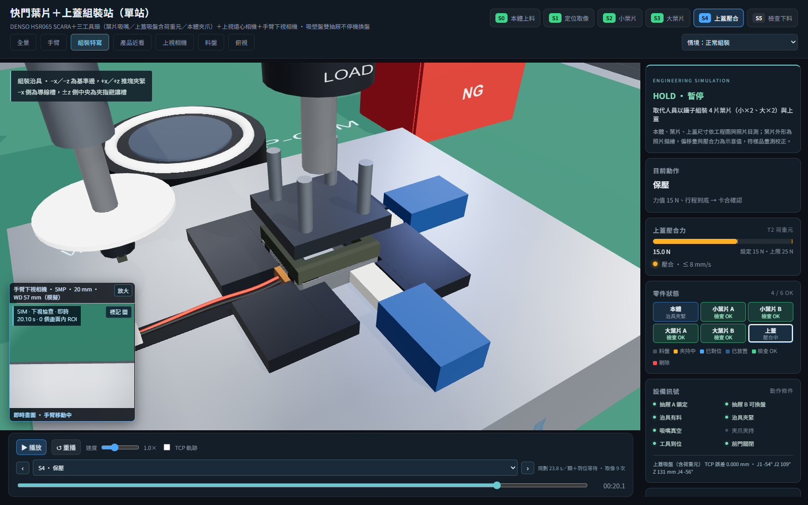
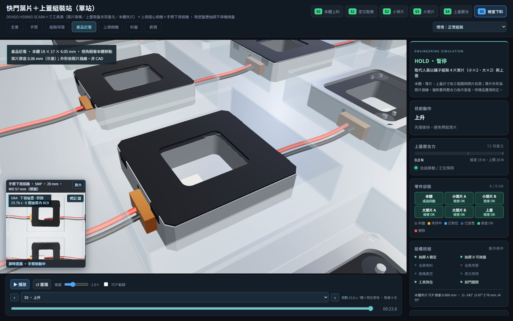
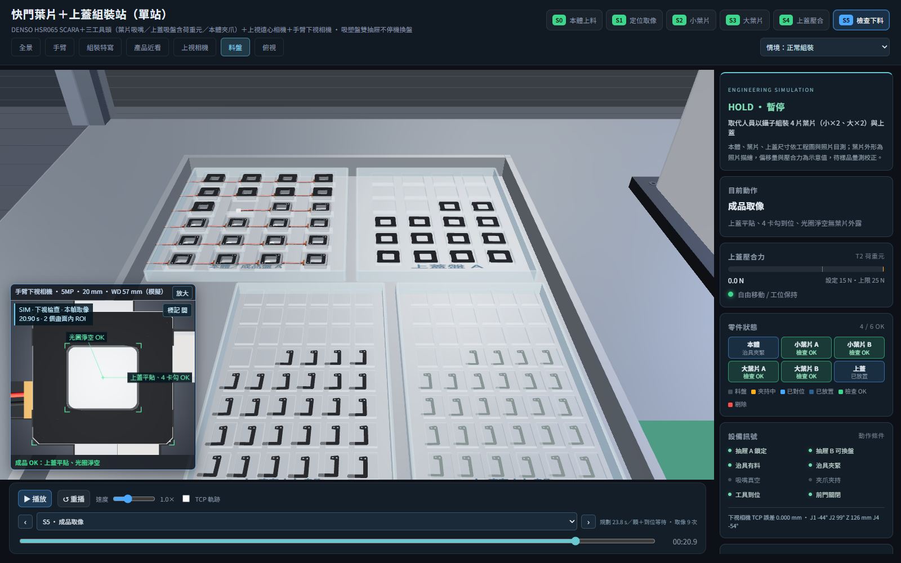

# 快門葉片＋上蓋組裝站：自動化方案 3D 模擬

取代影片中人員用鑷子組裝快門的作業：把 4 片葉片（小×2、大×2）套到本體的樞軸銷與撥桿銷上，再蓋上上蓋壓合。單站、一台 SCARA 完成全部動作。

- **DENSO HSR065 SCARA**＋三工具頭：T1 葉片吸嘴（多孔吸盤＋白色背景板）、T2 上蓋四點真空墊＋均壓外框（含荷重元，兼壓合）、T3 本體夾爪。三支工具各有氣動滑台，只有使用中的伸出。
- **上視遠心相機**量葉片與上蓋在吸嘴上的偏移，J4 轉到放料角度並補正後才放料；**手臂下視相機**定位銷、檢查疊放與成品。
- **雙抽屜吸塑盤**：每個抽屜一套 24 顆的料（本體／成品、上蓋、小葉片、大葉片），一個供料時另一個可以拉出換盤；成品放回本體盤原格。
- 規劃循環約 **23.8 秒／顆**（人員約 30 秒／顆）。所有 Three.js 依賴在 `web/vendor`，可離線執行。

文件：
- [自動化方案規劃](docs/automation-plan.md)：現況分析、設備配置、末端工具、治具、節拍、精度預算、選型、風險與待確認。
- [成本估算](docs/cost-estimate.md)（[試算表](docs/cost-estimate.xlsx)）。
- 用戶提供的工程圖、照片與影片在 `docs/`。



## 決策紀錄（選項對話）

| 題目 | 決定 |
|---|---|
| 運動平台 | DENSO SCARA（不用伺服 XYZθ 模組或六軸手臂） |
| 葉片供料 | 改用吸塑盤排列（柔性振動供料盤列為備案） |
| 葉片組成 | 小葉片 ×2＋大葉片 ×2，兩個樞軸各疊一小一大 |
| 進出料 | 吸塑盤進出、雙抽屜不停機換盤 |

## 流程

| 站別 | 動作 |
|---|---|
| S0 本體上料 | T3 從本體盤 #10 夾本體 → 放入治具 → 推塊推靠基準邊夾緊 |
| S1 定位取像 | 下視相機找 2 支 φ0.80 樞軸銷與 2 支撥桿銷 |
| S2 小葉片 | 每片：T1 吸取 → 上視相機量偏移 → J4 轉向並補正 → 慢速套入銷 → 放開；2 片後下視檢查 |
| S3 大葉片 | 同上；4 片後檢查疊放順序 |
| S4 上蓋壓合 | T2 吸上蓋 → 上視對位 → 放上 → 壓合 15 N、保壓 0.3 s → 破真空 |
| S5 檢查下料 | 下視拍成品 → 鬆開夾緊 → T3 夾成品放回本體盤原格 |

「情境」選單可切換**大葉片疊片 → 剔除重取**：上視相機發現兩片黏疊，吸嘴移到 NG 盒吹落，改取下一格。

## 啟動

```powershell
node ../core/tools/serve.mjs "shutter assembly"
# 或不自動開外部瀏覽器
node ../core/tools/serve.mjs "shutter assembly" --no-open
```

開啟 [本地模擬](http://127.0.0.1:8770/shutter%20assembly/)，也可雙擊 `run.bat`（所有專案共用 `core/tools/serve.mjs`，首頁 http://127.0.0.1:8770/ 列出全部專案）。ES module 需要 HTTP，不能直接用 `file://` 開 HTML。

## 操作

- 站別按鈕跳到 S0～S5（直接停在該站第一次取像）；下拉選單可選任一步驟（前面是步驟起始時間），搭配前後步與時間滑桿；速度 0.25～4×。
- 視角：全景、手臂、組裝特寫、產品近看（跟著本體移動）、上視相機、料盤、俯視；滑鼠可自由旋轉縮放。
- **左下子畫面**是相機實際看到的畫面：零件停在上視相機上方時顯示上視遠心相機（黑色葉片對白色背景板的剪影），其他時間顯示手臂下視相機。標記框與偏移量是模擬值，可用「標記 開／關」切換；「放大」保持完整感光元件比例。
- 右側「零件狀態」顯示本體、4 片葉片與上蓋目前在料盤、夾持中、已對位、已放置或檢查 OK。
- 「匯出紀錄」產生 JSON：情境、各零件狀態與示意偏移量、取像事件。**沒有實拍影像、沒有實測力值、未接 MES。**

網址參數：
- `?result=NG`：疊片剔除情境。
- `?pause&st=2&view=upcam`：直接看小葉片上視對位。
- `?pause&time=20.1&view=nest`：壓合瞬間；`time` 為流程秒數。
- `?cameraSize=large`、`?shadow=0`、`cam=x,y,z,tx,ty,tz`。

主控台：`window.sim.seekTo(sec)`、`pause()`、`play()`、`setView(name)`、`views`（視角名稱）、`total`、`T`、`steps`、`events`、`stationStart`。

## 建模

### 干涉與物理可行性修正

已修正手臂穿過後罩、導線與葉片超出料格、上蓋卡勾穿入側壁、壓頭過行程穿入上蓋，以及夾取／鬆夾時本體跳位。上視光路改為真正中空，NG 葉片加入落入盒底的過程。外罩占地調整為 1440 × 1120 mm。

正常與 NG 流程以最長 20 ms 間隔、包含步驟端點，共檢查 2,786 個姿態；取樣範圍內手臂距後罩最小約 78.29 mm，壓合時彈簧最大壓縮 0.30 mm。另檢查料格容納空間、201 個上蓋接近／卡扣位置與實際上視光路。結果無檢出的干涉；這是離散模型驗證，並非實機安全或公差認證。

詳見[物理檢查紀錄](review/physical-review.md)與[檢查數據](review/physics.json)。導線預成形、卡勾避讓槽及彈性行程屬於本次模型的設計假設，需依實物／供應商 CAD 確認；15 N 力值為示意。

```powershell
node --import ../core/tools/register.mjs tools/verify-physics.mjs
```

### 2026-09-26 實物細節更新

已比對 docs 的工程圖、組裝示意、6 張零件照片與約 66 秒影片的連續抽幀。照片中的薄片弧形邊缘、上蓋長孔／小孔、兩端銅線圈和金屬框層次用於改善外觀；既有 18 × 17 × 4.05 mm 本體、0.06 mm 葉片、0.20 mm 上蓋與定位銷基準維持原設定。無標註的外形、線圈與表面粗糙度仍是依照片建立的示意，非量測 CAD。

- 本體增加兩端內凹線圈腔、銅繞組細紋、轉子環、導線焊接點與端子開口。
- 葉片改成帶弧線的沖切輪廓；機器視覺描邊使用相同曲線。上蓋增加真正貫穿的沖孔與金屬切邊；黑色塗層和金屬表面增加低幅度微紋理。
- T1 的粗套環移至背景板上方，細真空管藏在葉片吸附區內；背景板擴大至直徑 32 mm，完整覆蓋 24 × 20 mm 相機視野。
- T2 四個真空墊避開上蓋沖孔；均壓背板仍保持離上蓋 2 mm 的間隙。工具接觸高度與運動序列不變。
- 產品局部陰影跟隨本體移動，縮小陰影範圍以呈現薄片接觸層次；治具增加固定螺絲，機櫃增加門縫、把手與散熱縫。

新增 `tools/verify-product-detail.mjs`：檢查貫穿孔、324 個上蓋吸附面取樣、葉片吸附面、線圈與最低葉片 0.135 mm 的垂直淨空，以及正常／NG 流程 1,287 條上視相機光線的輪廓遮擋。結果在 `review/product-detail.json`。既有 `tools/verify.mjs` 的兩種完整流程與 576 個料格高度可達性檢查也通過；以上均為模型驗證。

```powershell
node --import ../core/tools/register.mjs tools/verify-product-detail.mjs
```

GitHub 首頁與五專案發布設定：[static.yml](../tools/github-pages/static.yml)／[發布說明](../tools/github-pages/README.md)。需將新版工作流程放入 GitHub 儲存庫最外層 `.github/workflows/static.yml`，並上傳本專案 web 內容後才會更新線上網站。



- **產品**：本體 18 × 17 × 4.05 mm（照片量測＋工程圖 A）、光圈 9.4 × 8.4 mm、四角孔、側面 M1.6 螺孔、轉子座、φ0.80 樞軸銷與撥桿銷、線圈座與紅黑導線、白色端子。葉片依照片描繪成 C 形，一端有圓孔與長孔；小葉片灰色、大葉片黑色，厚度以 0.06 mm 表示。上蓋 0.20 mm（工程圖 O）含 4 個卡勾。
- **手臂**：HSR065 動作範圍 650 mm、Z 行程 200 mm。臂長分配 350＋300 mm、J1 座高、關節範圍與速度（假設型錄值的 50%）需以 DENSO 型錄與 CAD 核對。解析逆解，依流程順序選離前一點最近的肘部解，J4 取最接近的等價角。
- **運動**：自由移位走關節插值（PTP），時間依關節角度差自動算；下降、接近、上升走直線，最後 2 mm 減速到 30 mm/s，壓合 8 mm/s。
- **零件歸屬**：零件在料盤、工具上（跟著實際 TCP 移動）、治具、本體上或 NG 盒；吸取、放開的瞬間才換歸屬，所以動畫位置連續。放在本體上的葉片與上蓋會跟著本體一起被夾回料盤。
- **上視補正**：每片料在格內有示意偏移（例如小葉片 A：Δx +0.05、Δz −0.03 mm、θ +1.1°），吸嘴對準格中心吸取，上視相機量得偏移後修正放料位置與 J4 角度。

## 檔案

| 檔案 | 用途 |
|---|---|
| `web/js/product.js` | 本體、葉片、上蓋、成品幾何；樞軸銷與葉片安裝位置 |
| `web/js/cell.js` | 機台、雙抽屜與 4 種吸塑盤、組裝治具、上視相機、離子風嘴、NG 盒、外罩；料格座標。鋁擠型框架用 `MAT.frame`，治具座與抽屜用 `finished(MAT.alu, 'metal')`，台面板用 `finished(MAT.steel, 'metal')`（較深，維持與吸塑盤的對比）。地面用 core 的 `floor()`（`@core/geom/environment.js`：9 × 6 m 深色地坪＋200 mm 格線） |
| `web/js/robot.js` | HSR065、三工具頭、下視相機、解析逆解與關節規劃 |
| `web/js/sequence.js` | 單顆組裝流程、料件偏移與補正。排程本體是 core 的 `createStepSequence`（快照、插值、`stationStart`、`total`、`events`；零件歸屬 `loc` 用 `latch` 在步驟完成才換，NG 落下步驟以 `easeKeys: { drop: linear }` 讓 `drop` 隨時間線性）；本檔只做取放料拆解、PTP 時間依關節速度延長、NG 疊片剔除，取樣時補上 SCARA 姿態（PTP 關節插值／直線段） |
| `web/js/station.js` | 組裝整站、依歸屬擺放零件（畫面與驗證共用） |
| `web/js/project.js` | 專案介面 `createProject({ scene })`：建立整站與流程，`apply(t)` 把整個場景放到時間 t；網頁與 core 統一檢查共用（`?result=NG` 對應 `ng: true`） |
| `web/js/main.js` | renderer、場景、相機、軌道控制、環境光與主要燈光由共用舞台 `createStage`（`core/ui/stage.js`）建立：外觀用 `look: 'cell'`（曝光、背景、半球光與太陽／補光的顏色強度），本檔只傳差異（RoomEnvironment 點光 220、太陽與補光位置、陰影範圍與 bias、霧、縮放距離）；`extent` 推算的燈位、陰影範圍與 bias 都和原本不同，所以燈位與陰影照舊明確寫；作業區局部光（跟隨本體、細緻陰影）在本檔。畫面迴圈用 `stage.loop`（自訂繪製：HUD＋主畫面＋相機子畫面）；3D 標籤用 `stage.addLabel`／`updateLabels`（畫布偏移由 stage 處理；小螢幕重疊時依 `priority` 先留手臂，其次治具與上視相機），視角轉場用 `stage.goTo`（手機直向等窄畫布由 stage 自動拉遠；橫向手機畫布寬高比 > 2 時，上視相機視角整體下移 30 mm，環形光才不會落在畫布底邊，桌面不變），追隨鏡頭接手時 `stage.cancelTween()`，產品近看跟著本體用 `stage.shiftView`（轉場中也跟）；播放列用 `createPlayer`（`core/ui/player.js`，事件選單取排程的 `events`）：跳播走 `apply(T, { seek: true })`（`project.apply`，手臂直接到位），連續播放走 `advance(T, dt)`：以 5 ms 細分、手臂以實際限速追蹤，步驟結束（含最後一步）或接近／接觸中偏離時等到位才前進，等超過 5 秒回傳 `null` 讓播放列停住並報逾時，再按播放時手臂先重新到位。UI、紀錄匯出；設備與時間軸取自 `project.js`；`window.sim` 由 `exposeSim` 提供。網址 `?movie` 時不跑畫面迴圈，改由 `core/movie/movie.js` 的 `installMovie` 依絕對時間逐格錄影（取樣走 `project.apply`，鏡頭跟著手上的零件） |
| `web/css/style.css` | 版面與面板樣式。≤900 px、觸控平板與橫向手機由 core 的精簡版面（`createViewerWorkspace`）接手，本檔只留 900～1100 px 桌面窄視窗的規則；精簡版面中產品近看／組裝特寫的說明貼齊畫布頂端（`--viewer-top`），不壓在產品上 |
| `web/js/vision-results.js` | 相機標記（孔位、疊片、銷位、成品） |
| `tools/verify.mjs`、`verify-physics.mjs`、`verify-product-detail.mjs` | 專案自有驗證（流程、物理、產品細節） |
| `tools/build_cost_estimate.py` | 產生成本試算表 |

## 驗證

需要 Node.js 22 以上，不需 npm 套件。全部檢查（import 路徑、倒序一致、全場干涉與重合面，加上 `project.json` 列的專案驗證）：

```powershell
node ../core/tools/check.mjs shutter          # 在本資料夾；在 TestCode 則為 node core/tools/check.mjs shutter
node --import ../core/tools/register.mjs tools/verify.mjs   # 只跑流程驗證
```

全場檢查結果在 `review/scene-verification.txt`。目前只剩產品內部（本體各層、0.06 mm 葉片疊片、0.2 mm 上蓋）的重合面：core 的 0.6 mm 重合面與 2 mm 穿插門檻是設備尺度，不適用這些零件的實際間隙（0.02～0.3 mm）；產品配合由下列專案驗證以 0.005 mm 檢查。

正常與疊片 NG 兩種情境都檢查：
- 全部步驟代表時刻的 TCP 可達性（PTP 步驟檢查終點）與關節限位；兩個抽屜 576 個取料位置（每格取料高度＋移動高度）全部搆得到，最小關節餘裕 7.6（° 或 mm）。
- 任意倒退／跳站後狀態與 TCP 目標一致。
- 工具頭對治具槽壁、推塊、上視環形光、離子風嘴、NG 盒、抽屜、手臂基座與外罩的碰撞（接近與接觸步驟只允許吸盤、吸嘴桿與夾指進入產品與料盤包絡）；夾持中的零件在移動段不得碰撞。
- 放料瞬間，零件實際位置對目標位姿的誤差 ≤ 0.005 mm（以未補正 0.02 mm 偏移做反向測試，確認這項檢查抓得到）；結束時 4 片葉片的圓孔與長孔都對準銷、疊放順序正確、上蓋壓到底並對正、成品回到原格。
- 9 次（NG 10 次）取像時，被拍物完整在相機視野內。
- 連續播放（實際限速＋到位等待，每 0.25 秒做一次碰撞檢查）。

最近一次結果在 `review/verification.json`。模擬中的放料誤差是補正計算的誤差，**不是設備精度**，設備精度看[規劃文件第 7 節](docs/automation-plan.md#7-精度預算)。

## 畫面

| | |
|---|---|
|  上視遠心相機量葉片偏移 |  疊片判定 NG |
|  上蓋壓合 15 N |  成品放回原格 |
|  抽屜 A 的 4 種吸塑盤 | |


## 線材配置與防干涉

網頁新增「線材配置」視角與配色說明，包含主要外露線束、固定夾、分隔線槽與適用的活動拖鏈。

SCARA 兩臂固定護套、R25 mm Z 軸拖鏈、旋轉入口與末端氣管；相機與治具線路沿固定支架及機櫃整理。

[配線研究與實機確認項目](../tools/docs/cable-routing-review.md)｜[本機 docs 配線紀錄](docs/cable-management.md)｜[線材檢查結果](review/cables.json)｜[配線畫面](review/cables.png)

共用檢查：在 TestCode 執行 `node tools/verify-cable-routing.mjs`。docs 依現有忽略規則僅留在本機；根目錄研究文件隨原始碼保存。


## 視窗操作與產品焦點

相機標題列可拖曳，右上角可放大、獨立開窗或隱藏；主畫面上方的 ◧／◨ 可收合資訊，▣ 恢復相機面板，◎ 切換近距離產品追隨。獨立視窗共用主時間軸與檢測標記。

[完整操作說明與驗證範圍](../tools/docs/viewer-controls.md)｜[介面畫面](review/viewer-workspace.png)

## 電控規劃檢視

上方「⚡ 電控規劃」可查看元件用途、功能連接及配置外形；支援剖視、透視、點選與特寫，顯示狀態共用主時間軸。[本站元件清單](docs/electrical-plan.md)。

## 電路圖

[圖紙索引與設計說明](docs/circuit-diagrams.md) · [A3 PDF 圖冊](docs/circuit-diagrams.pdf)。可編輯 SVG 與圖面資料位於 `docs/electrical/`。
